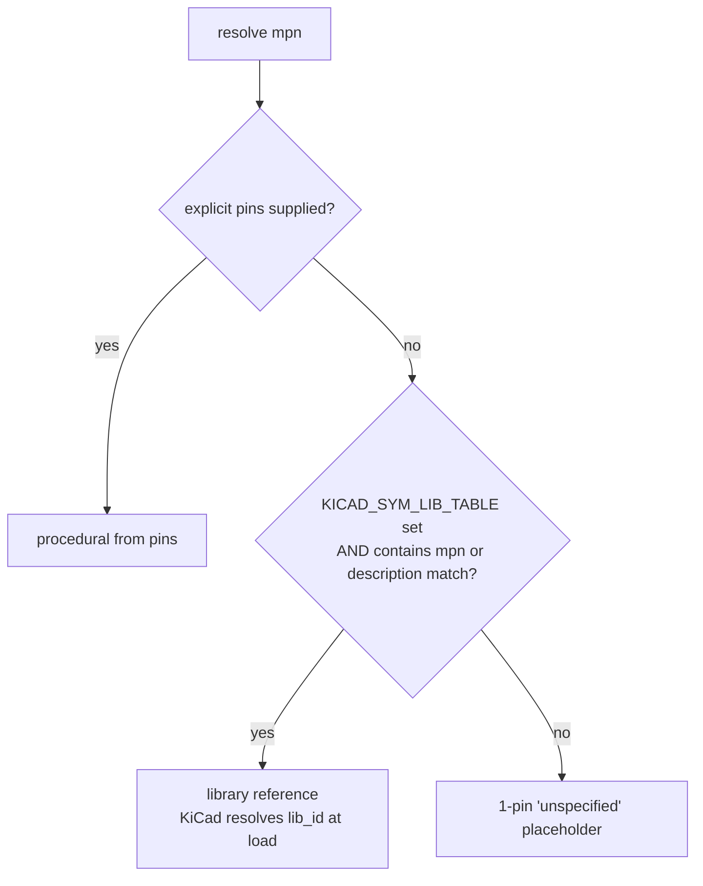

How the system decides what symbol to draw for a given part. There is **one** precedence rule, worth internalizing.

## The rule

Code: `SymbolResolver.resolve()` at `backend/services/symbol_resolver.py:23`.

## Why pins beat libraries

Counter-intuitive at first: if the user has the STM32 symbol in their local libraries, shouldn't we prefer that? No — because `pins` in the resolver's argument list are **datasheet-derived ground truth** (via [[entities/pinout-extractor]]). The library symbol might use different naming conventions, a manufacturer variant with different pin numbering, or an outdated version. Authoritative pin data, when we have it, wins.

If you want to *force* library reuse for a part you know has an extracted pinout, call `generate_schematic` without the `pins` arg.

## The placeholder is intentional

A 1-pin `unspecified` fallback is an obvious visual signal in KiCad — it's clearly not a real symbol. It exists so that `generate_schematic` always produces a valid `.kicad_sch` file, never an error. The download works; the schematic is just obviously incomplete. This matches the UX goal: ship something the user can see and react to, don't block.

## Corollaries for tool chaining

- If the agent has *only* an MPN and no datasheet URL, calling `generate_schematic` without pins is fine — library reuse or the placeholder will produce a working file.
- If the agent has a datasheet URL and wants a real symbol, it must call `extract_pinout` first. See [[concepts/tool-calling-flow]].
- Library search is case-insensitive and tries `mpn` first, then `description`. Partial matches are allowed (see `backend/services/kicad_libs.py`).

## Related

- [[entities/schematic-service]]
- [[concepts/tool-calling-flow]]
