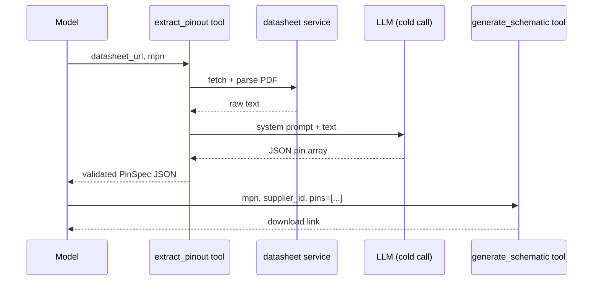

Dedicated second LLM call that turns raw datasheet text into a validated `list[PinSpec]`. Lives in `backend/services/pinout.py`; surfaced to the agent as the `extract_pinout` tool.

## Why a separate LLM call

The datasheet text is tens of thousands of tokens. Injecting it into the primary chat context would evict previous turns and blow cost for every follow-up message. The extractor takes a **cold** LiteLLM `completion()` with only (a) a schema-constrained system prompt and (b) the truncated datasheet text. Its output — a small JSON array — is what flows back into the agent.

## Contract

```
extract_pinout(datasheet_url: str, mpn: str, *, model: str | None = None) -> list[PinSpec]
```

Pipeline:

1. `extract_datasheet_text(datasheet_url)` — may raise `DatasheetError` ([[entities/datasheet-service]]). Not caught here; propagates.
2. Truncate to `_MAX_TEXT_CHARS = 60_000` if needed (line 19). Pin tables are almost always in the first 10–20 pages.
3. Call `completion()` with a fixed system prompt + `user` message `"Component MPN: {mpn}\n\nDatasheet text:\n{text}"`.
4. `_parse_pin_json` strips optional markdown fences, `json.loads`, validates each entry.

## Validation rules (`_parse_pin_json`)

- Top-level must be a JSON array → else `PinoutExtractionError`.
- Each entry must be a dict with non-empty string `number` and `name`.
- `type` is lowercased and checked against `VALID_PIN_TYPES` (defined in `backend/services/procedural_symbol.py:10`). Unknown types are *dropped* (logged at INFO) — a single bad entry doesn't nuke the whole extraction.
- If *all* entries fail validation → `PinoutExtractionError`.

## Tool registration

Tool schema declared in `backend/services/tools.py`. Two tool-layer behaviors worth noting:

- The `extract_pinout` dispatch returns a JSON string (`json.dumps([{number,name,type},...])`) for the model to parse on its next turn. Errors are returned as plain strings starting with `"Error"`.
- `generate_schematic` accepts an optional `pins` array. `_coerce_pins` in `tools.py` converts dicts to `PinSpec`, silently dropping invalid entries — symmetric with the extractor.

## Agent flow



## Open question

The primary chat system prompt (`backend/main.py:127`) does not mention `extract_pinout`. Modern models can discover it from the tool description alone, but adding an explicit instruction ("if the user wants a real multi-pin symbol and you have a datasheet URL, call `extract_pinout` first") would make it more reliable. Tracked informally — reconsider if pinout-chaining ends up being underused in practice.
