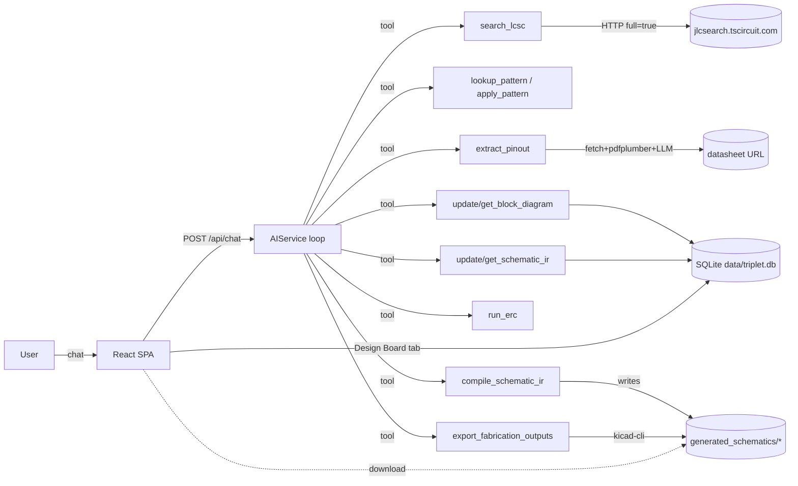

One-page tour of the TripleT KiCad Agent. The roadmap lives in `PLANNING.md`; this page documents *what exists today*.

## Mental model

An LLM-backed chat agent that turns natural-language EDA requests into concrete KiCad artefacts. Beyond part search and one-off schematic generation, the agent now drives a full board-design pipeline persisted per project: **block diagram** (logical architecture) → **schematic/netlist IR** (components, pins, nets, footprints) → **local ERC** → **compile to a complete KiCad project** (`.kicad_pro`, `.kicad_sch`, generated symbol library, `sym-lib-table`).

## Stack

**Backend** — Python ≥3.12, `uv`, FastAPI + Uvicorn, LiteLLM async (OpenAI/Anthropic/Gemini), SQLModel + aiosqlite, httpx, pdfplumber, rank-bm25, kicad-sch-api, pytest.

**Frontend** — React 19 + TypeScript 5.9 on `rolldown-vite`, Tailwind v4, axios, react-markdown, lucide-react. State is one `BOMContext` backed by the projects API.

**Persistence.** SQLite (`data/triplet.db`) stores projects, BOM items, chat messages, block diagrams, and schematic IR. `.env` stores settings; `generated_schematics/` stores output files.

## Directory layout

| Path | Purpose | Detail |
|---|---|---|
| `backend/main.py` | FastAPI app, CORS, routes, chat system prompt (board-design workflow). | [[entities/http-api]] |
| `backend/db.py` | Async SQLite engine/session factory. | [[entities/http-api]] |
| `backend/routers/settings.py` | `GET`/`POST /api/settings` — env-var mirror. | [[entities/http-api]] |
| `backend/routers/projects.py` | Projects, BOM, messages, block diagram, schematic IR, ERC, compile. | [[entities/http-api]] |
| `backend/models/project.py` | SQLModel tables incl. `BlockDiagram`, `SchematicIR`. | [[entities/http-api]] |
| `backend/models/schematic_ir.py` | Pydantic IR schemas (incl. `package`, `footprint`). | [[entities/schematic-service]] |
| `backend/services/ai.py` | Multi-turn async tool loop. | [[entities/ai-service]] |
| `backend/services/tools.py` | Tool JSON schemas + project-scoped `execute_tool()`. | [[concepts/tool-calling-flow]] |
| `backend/services/lcsc.py` | Part search proxy (full rows: datasheet URL, tiered price). | [[entities/lcsc-service]] |
| `backend/services/schematic.py` | Emits `.kicad_sch` and complete KiCad projects from the IR. | [[entities/schematic-service]] |
| `backend/services/erc.py` | Local ERC over the netlist IR. | [[entities/schematic-service]] |
| `backend/services/footprints.py` | Package string → KiCad footprint ID mapping. | [[entities/schematic-service]] |
| `backend/services/fabrication.py` | `kicad-cli` wrapper (native ERC, netlist/BOM/PDF, Gerbers). | [[entities/schematic-service]] |
| `backend/services/symbol_resolver.py` | Pins → library → placeholder precedence. | [[concepts/symbol-resolution]] |
| `backend/services/kicad_libs.py` | `sym-lib-table` + `.kicad_sym` indexer. | [[entities/schematic-service]] |
| `backend/services/procedural_symbol.py` | Rectangle-with-pins S-expression builder. | [[entities/schematic-service]] |
| `backend/services/datasheet.py` | Async PDF fetch + text extract. | [[entities/datasheet-service]] |
| `backend/services/pinout.py` | `extract_pinout` — LLM → `PinSpec[]`. | [[entities/pinout-extractor]] |
| `backend/knowledge/` | Pattern protocol, registry, retriever, seed patterns. | [[entities/pattern-library]] |
| `backend/tests/` | pytest suite (96 tests as of 2026-06-11). | [[concepts/testing-strategy]] |
| `frontend/src/` | React SPA (Home / Design Board / BOM / Settings). | [[entities/frontend]] |

## Request flow: a typical chat turn

1. Browser `POST /api/chat` with the accumulated message thread and the active `project_id`.
2. `backend/main.py` prepends the system prompt (including the architect → source → pinout → connect → verify → compile workflow) unless one is present.
3. `AIService.get_response` calls LiteLLM `acompletion` with `tool_choice="auto"` and the full tool list.
4. If the model returns `tool_calls`, each is dispatched via `execute_tool` (project-scoped), results are appended as `role: tool` messages, and the loop iterates. Bounded by `AI_MAX_TOOL_TURNS` (default 24).
5. When the model returns plain content, the loop returns it. `/api/chat` wraps it as `{content: "..."}` and persists both sides of the exchange.

## Configuration surfaces

Settings live in environment variables, mirrored by the UI's Settings page:

- Writing via the Settings page calls `POST /api/settings` which updates `os.environ` *and* rewrites `.env`.
- Reading: each service reads directly from `os.environ` when it needs a value.

See [[concepts/configuration]] for the full variable list.

## What's *not* here

- `.kicad_pcb` generation, placement, and routing — board layout happens in KiCad (footprints are pre-assigned, so "Update PCB from Schematic" works directly). Gerber/drill export via `kicad-cli` requires KiCad installed server-side.
- Authentication — the server listens locally only, no auth layer.
- Test coverage for the frontend — no Jest/Vitest setup.
