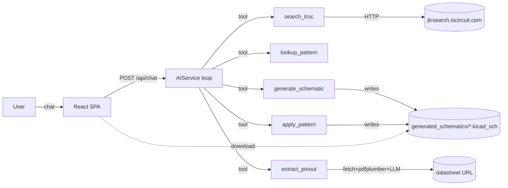

One-page tour of the TripleT KiCad Agent. The roadmap lives in `PLANNING.md`; this page documents *what exists today*.

## Mental model

An LLM-backed chat agent that turns natural-language EDA requests into concrete KiCad artefacts. The agent has four capabilities exposed as tools: **search a part**, **look up a verified circuit pattern**, **apply a pattern**, and **generate a schematic file** (optionally from an extracted datasheet pinout).

## Stack

**Backend** — Python ≥3.14, `uv`, FastAPI + Uvicorn, LiteLLM (OpenAI/Anthropic/Gemini), httpx, pdfplumber, rank-bm25, kicad-sch-api, pytest.

**Frontend** — React 19 + TypeScript 5.9 on `rolldown-vite`, Tailwind v4, axios, react-markdown, lucide-react. State is one `BOMContext`.

**No database.** Persistence is `.env` (settings) and `generated_schematics/` (output files). The draft PR #13 adds SQLite; not landed.

## Directory layout

| Path | Purpose | Detail |
|---|---|---|
| `backend/main.py` | FastAPI app, CORS, routes, chat system prompt. | [[entities/http-api]] |
| `backend/routers/settings.py` | `GET`/`POST /api/settings` — env-var mirror. | [[entities/http-api]] |
| `backend/services/ai.py` | Multi-turn tool loop. | [[entities/ai-service]] |
| `backend/services/tools.py` | Tool JSON schemas + `execute_tool()`. | [[concepts/tool-calling-flow]] |
| `backend/services/lcsc.py` | Part search proxy. | [[entities/lcsc-service]] |
| `backend/services/schematic.py` | Emits `.kicad_sch`. | [[entities/schematic-service]] |
| `backend/services/symbol_resolver.py` | Pins → library → placeholder precedence. | [[concepts/symbol-resolution]] |
| `backend/services/kicad_libs.py` | `sym-lib-table` + `.kicad_sym` indexer. | [[entities/schematic-service]] |
| `backend/services/procedural_symbol.py` | Rectangle-with-pins S-expression builder. | [[entities/schematic-service]] |
| `backend/services/datasheet.py` | Async PDF fetch + text extract. | [[entities/datasheet-service]] |
| `backend/services/pinout.py` | `extract_pinout` — LLM → `PinSpec[]`. | [[entities/pinout-extractor]] |
| `backend/knowledge/` | Pattern protocol, registry, retriever, seed patterns. | [[entities/pattern-library]] |
| `backend/tests/` | pytest suite (67 tests as of 2026-04-24). | [[concepts/testing-strategy]] |
| `frontend/src/` | React SPA. | [[entities/frontend]] |

## Request flow: a typical chat turn

1. Browser `POST /api/chat` with the accumulated message thread.
2. `backend/main.py:118` prepends the system prompt unless one is present.
3. `AIService.get_response` (`backend/services/ai.py:44`) calls LiteLLM with `tool_choice="auto"` and the full tool list.
4. If the model returns `tool_calls`, each is dispatched via `execute_tool` (`backend/services/tools.py`), results are appended as `role: tool` messages, and the loop iterates. Bounded by `AI_MAX_TOOL_TURNS` (default 6).
5. When the model returns plain content, the loop returns it. `/api/chat` wraps it as `{content: "..."}`.

## Configuration surfaces

Settings live in environment variables, mirrored by the UI's Settings page:

- Writing via the Settings page calls `POST /api/settings` which updates `os.environ` *and* rewrites `.env`.
- Reading: each service reads directly from `os.environ` when it needs a value.

See [[concepts/configuration]] for the full variable list.

## What's *not* here

- Database / persistence (PR #13 draft).
- Algorithmic component placement or auto-wiring (Phase 4, not started).
- Authentication — the server listens locally only, no auth layer.
- Test coverage for the frontend — no Jest/Vitest setup.
